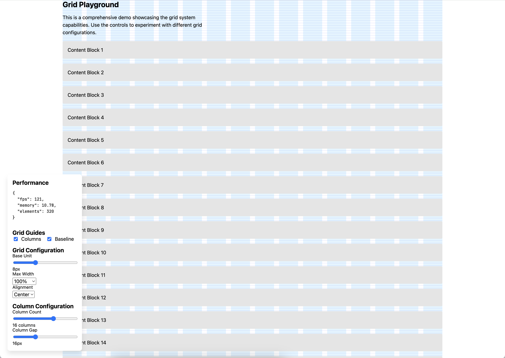

# Padded Grid

A development tool for visualizing and maintaining consistent grid systems in React applications. Similar to design
tools like Figma, it provides toggleable grid overlays that help ensure precise spacing, alignment, and layout
consistency during development.

## What is it?

Padded Grid helps you:

- Visualize column grids and baseline grids while building your layouts
- Maintain consistent spacing and alignment across your application
- Toggle different grid systems on/off during development
- Ensure your designs match their specifications

↓ Demo in construction...



## Features

- 🎯 Interactive grid overlays for development
- 📏 Column grid visualization (like Figma's layout grid)
- 📐 Baseline grid for typography alignment
- 🎚️ Toggleable grid guides
- 📱 Responsive grid visualization
- 🎨 Customizable grid colors and opacity
- 🔧 TypeScript-first with comprehensive types
- ⚡️ Zero runtime dependencies
- 🪶 Tree-shakeable & optimized bundle

## Why Use It?

When building complex layouts, it's crucial to maintain consistent spacing and alignment. While CSS Grid and Flexbox are
powerful layout tools, they don't provide visual guides during development. Padded Grid bridges this gap by offering:

1. **Visual Feedback**: See your grid system while you build
2. **Design Consistency**: Match your implementation to design specs
3. **Typography Alignment**: Ensure text follows your baseline grid
4. **Development Efficiency**: Quickly spot alignment issues

[Rest of README content...]

## Installation

```bash
# npm
npm install padded-grid
```

## Quick Start

```tsx
import { PaddedGrid, XGrid, YGrid } from 'padded-grid';
import 'padded-grid/styles.css';

function App() {
  return (
    <PaddedGrid config={{ maxWidth: "1200px" }}>
      <XGrid columns={12} gap={16} />
      <YGrid base={8} />
      <main> Content</main>
    </PaddedGrid>
  );
}
```

## Development Usage

```tsx
import { PaddedGrid, XGrid, YGrid } from 'padded-grid';
import 'padded-grid/styles.css';

function App() {
  // Toggle grid visibility during development
  const showGrid = process.env.NODE_ENV === 'development';

  return (
    <PaddedGrid>
      {/* Column grid overlay */}
      <XGrid columns={12} gap={16} show={showGrid} />

      {/* Baseline grid for typography alignment */}
      <YGrid base={8} show={showGrid} />

      <main>Your content...</main>
    </PaddedGrid>
  );
}
```

The grid overlays help you visualize and maintain consistent spacing during development. See
our [Development Usage Guide](./docs/DEVELOPMENT_USAGE.md) for detailed examples and best practices.

## Documentation

- [Grid System Documentation](./docs/GRID_SYSTEM.md) - Core concepts and formulas
- [Component API Reference](./docs/COMPONENTS.md) - Detailed component docs
- [Examples & Use Cases](./docs/EXAMPLES.md) - Common patterns

## Browser Support

- Modern browsers (Chrome, Firefox, Safari, Edge)
- CSS Grid Layout support required
- No IE11 support

## Contributing

See [CONTRIBUTING.md](./CONTRIBUTING.md) for guidelines.

## License

MIT © [François Denavaut](https://github.com/dnvt)